#cka #kubernetes #reference

# CKA Resource Linkage Reference

> Mental model for how K8s objects wire together, plus quick imperative/declarative commands. All diagrams are Mermaid — render natively in Obsidian.

---

## 1. The Big Picture

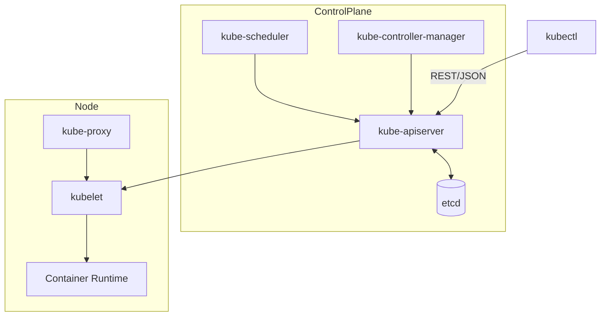

Everything you `kubectl apply` is a record in etcd via the API server. Controllers (in kube-controller-manager) watch for desired-vs-actual state drift and reconcile. Keep this loop in your head for every resource below: **spec (desired) → controller reconciles → status (actual)**.

---

## 2. Workload Chain: Deployment → ReplicaSet → Pod → Service

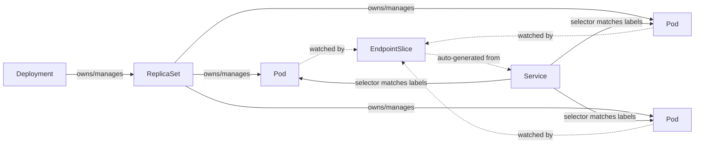

Key linkage facts examiners love to test:
- **Deployment → ReplicaSet**: Deployment owns RS via `ownerReferences`; a new RS is created on every spec/template change (rolling update), old RS scaled to 0 and kept for rollback history (`revisionHistoryLimit`).
- **Service → Pod**: no direct object reference at all — pure **label selector matching**. If labels drift, the Service silently stops routing to that Pod.
- **EndpointSlices** are the real-time mapping of Service → Pod IPs; `kubectl get endpointslices` when a Service "isn't working."
- **StatefulSet** differs from Deployment: stable network ID (`pod-0`, `pod-1`...), ordered rollout, requires a **headless Service** (`clusterIP: None`) for stable DNS per pod, and pairs with `volumeClaimTemplates` for per-pod PVCs.
- **DaemonSet**: one pod per (matching) node, no replica count, ignores scheduler in the "fits everywhere" sense but still respects taints/tolerations/nodeSelector.

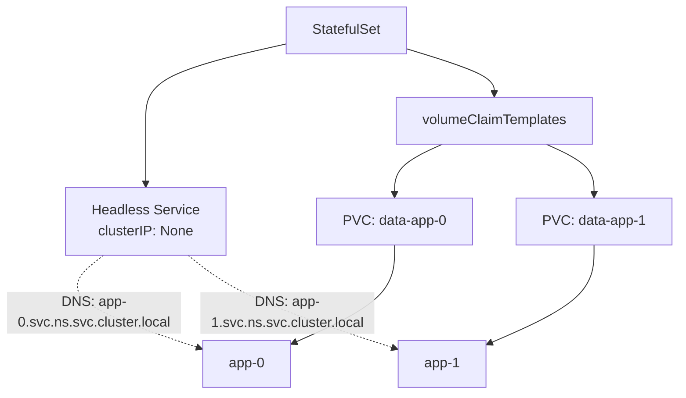

---

## 3. Storage: PV ↔ PVC ↔ StorageClass ↔ Pod

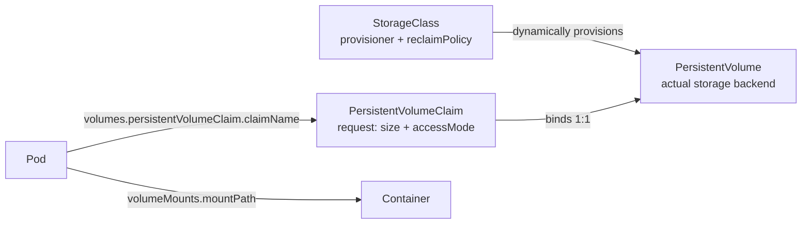

- **Binding is 1:1**: once a PVC binds to a PV, that PV is reserved even if oversized for the claim.
- Without a `StorageClass`, PVs must be pre-provisioned manually (static provisioning) and match on `accessModes` + `storageClassName` + capacity.
- **reclaimPolicy** on the PV decides what happens after PVC deletion: `Retain` (manual cleanup, data kept), `Delete` (backing storage destroyed), `Recycle` (deprecated).
- **accessModes**: `ReadWriteOnce` (single node), `ReadOnlyMany`, `ReadWriteMany` (needs a backend that supports it, e.g. NFS), `ReadWriteOncePod` (newer, single pod).
- Pod → PVC is a name reference in `spec.volumes`, then `volumeMounts` in the container spec maps that named volume into a path inside the container filesystem.
- `kubectl get pv,pvc` — check `STATUS` column: `Available` / `Bound` / `Released` / `Failed`.

---

## 4. Networking: Service Types → Ingress → Ingress Controller → Gateway API

### 4a. Service types (north-south exposure ladder)

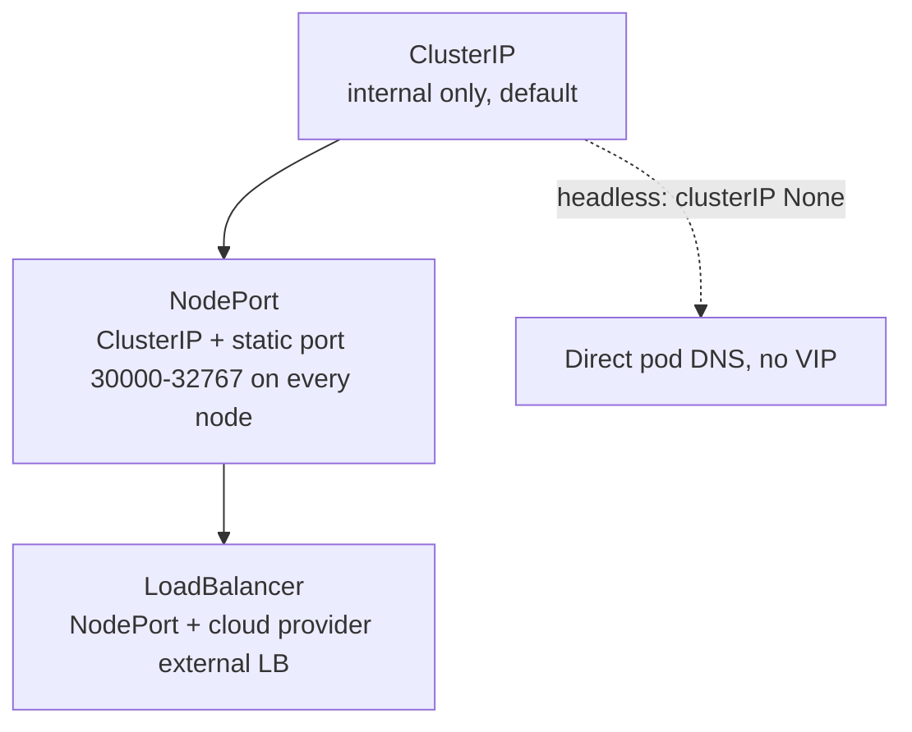

### 4b. Ingress path

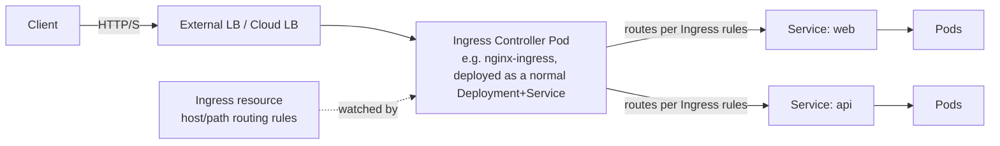

- The **Ingress object itself does nothing** — it's just rules in etcd. An **Ingress Controller** (a separate workload you must deploy, e.g. ingress-nginx) watches Ingress objects and programs its own proxy accordingly.
- `ingressClassName` on the Ingress resource ties it to a specific controller when multiple exist in-cluster.
- Common exam trap: creating an Ingress with no controller installed → routes never resolve, nothing "broken" to debug, just missing a component.

### 4c. Gateway API (the newer, more expressive model — increasingly on the CKA syllabus)

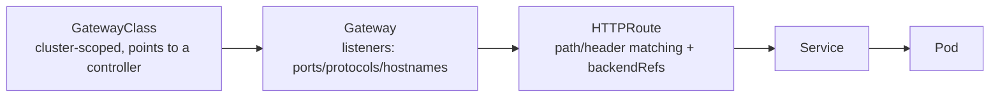

| Ingress model | Gateway API model |
|---|---|
| `Ingress` | `Gateway` + `HTTPRoute`/`TCPRoute`/etc |
| `IngressClass` | `GatewayClass` |
| One object mixes L4/L7 concerns | Split: Gateway = infra/listeners, Route = routing logic (better for shared multi-team clusters) |
| Vendor annotations for advanced routing | Native fields for header/weight-based routing, no annotation soup |

### 4d. Sidecars & the traffic path through a mesh (if relevant to your exam version)

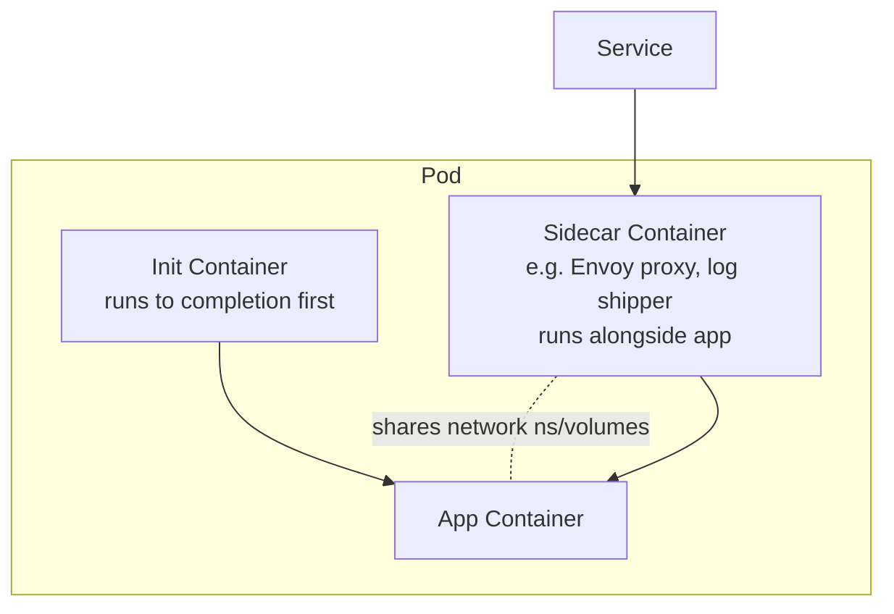

- **initContainers**: run sequentially, must all exit 0 before app containers start. Used for setup (e.g. wait-for-dependency, permission-fixing).
- **Sidecars** (native support since K8s 1.28 via `restartPolicy: Always` on an initContainer entry, prior to that just "another container in the pod spec"): share the pod's network namespace and can share volumes; classic use = service mesh proxy (Istio/Linkerd Envoy) that intercepts all in/out traffic transparently.
- All containers in a pod share **network namespace** (same IP, localhost between them) and any **volumes** explicitly mounted into more than one.

---

## 5. RBAC: Identity → Role → Binding

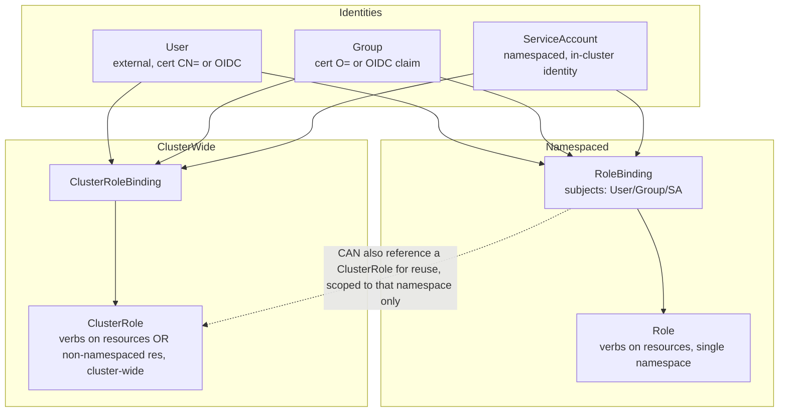

Four binding combinations — memorize this table, it's the classic exam trip-up:

| Binding | Role type | Effective scope |
|---|---|---|
| RoleBinding | Role | That one namespace only |
| RoleBinding | ClusterRole | That one namespace only (reuses a cluster-wide role definition, but grant is still namespace-local) |
| ClusterRoleBinding | ClusterRole | Entire cluster, all namespaces |
| ~~ClusterRoleBinding~~ | ~~Role~~ | **Invalid** — Roles are namespaced, cannot be cluster-bound |

- A **ServiceAccount** is auto-created (`default`) per namespace; pods use it via `spec.serviceAccountName`, and its token is auto-mounted at `/var/run/secrets/kubernetes.io/serviceaccount/`.
- `kubectl auth can-i <verb> <resource> --as=<subject> -n <ns>` is your debugging command for every RBAC question.
- Aggregated ClusterRoles (`aggregationRule` + matching labels) let you compose broad roles (e.g. `admin`/`edit`/`view` defaults) from smaller pieces — worth knowing exists, rarely need to write one.

---

## 6. NetworkPolicy: default-allow → deny → selective allow

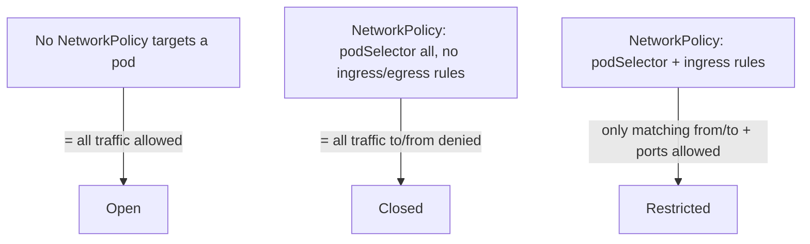

- Policies are **additive/whitelisting only** — once *any* NetworkPolicy selects a pod for `ingress`, all ingress not explicitly allowed is denied (same independently for `egress`). No "deny" rules exist, only allow rules that narrow the default-open posture.
- Requires a CNI plugin that enforces NetworkPolicy (Calico, Cilium — **not** flannel by default). If your CNI doesn't support it, policies apply silently with zero effect — classic exam gotcha.
- `ingress[].from` and `egress[].to` can match on `podSelector`, `namespaceSelector`, or `ipBlock` (with `except` CIDR carve-outs).

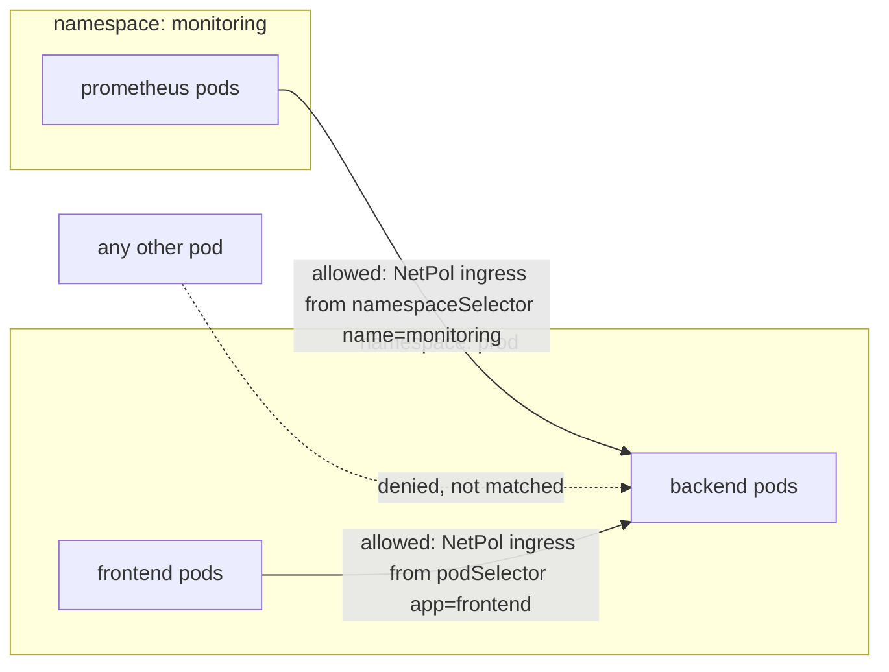

---

## 7. Quick Command Reference

### Imperative (fast, exam-time generation of YAML skeletons)

```bash
# Pods / Deployments
kubectl run nginx --image=nginx --restart=Never                 # bare pod
kubectl create deployment web --image=nginx --replicas=3
kubectl expose deployment web --port=80 --target-port=8080 --type=ClusterIP
kubectl scale deployment web --replicas=5
kubectl set image deployment/web nginx=nginx:1.27
kubectl rollout status deployment/web
kubectl rollout undo deployment/web

# Generate YAML without creating (the exam-day trick: --dry-run + -o yaml)
kubectl create deployment web --image=nginx --dry-run=client -o yaml > deploy.yaml
kubectl run nginx --image=nginx --dry-run=client -o yaml > pod.yaml

# Services
kubectl create service clusterip my-svc --tcp=80:8080
kubectl create service nodeport my-svc --tcp=80:8080

# ConfigMap / Secret
kubectl create configmap app-config --from-literal=KEY=value --from-file=./file.conf
kubectl create secret generic app-secret --from-literal=PASS=secret123

# Namespaces / context
kubectl create namespace dev
kubectl config set-context --current --namespace=dev

# RBAC
kubectl create serviceaccount ci-bot -n dev
kubectl create role pod-reader --verb=get,list,watch --resource=pods -n dev
kubectl create clusterrole node-reader --verb=get,list --resource=nodes
kubectl create rolebinding pod-reader-binding --role=pod-reader --serviceaccount=dev:ci-bot -n dev
kubectl create clusterrolebinding node-reader-binding --clusterrole=node-reader --serviceaccount=dev:ci-bot
kubectl auth can-i list pods --as=system:serviceaccount:dev:ci-bot -n dev

# PVC quick generate
kubectl get pv,pvc -A
```

### Declarative essentials (skeletons worth having memorized cold)

**PVC:**
```yaml
apiVersion: v1
kind: PersistentVolumeClaim
metadata:
  name: data-claim
spec:
  accessModes: ["ReadWriteOnce"]
  storageClassName: standard
  resources:
    requests:
      storage: 5Gi
```

**Role + RoleBinding:**
```yaml
apiVersion: rbac.authorization.k8s.io/v1
kind: Role
metadata:
  name: pod-reader
  namespace: dev
rules:
- apiGroups: [""]
  resources: ["pods"]
  verbs: ["get", "list", "watch"]
---
apiVersion: rbac.authorization.k8s.io/v1
kind: RoleBinding
metadata:
  name: pod-reader-binding
  namespace: dev
subjects:
- kind: ServiceAccount
  name: ci-bot
  namespace: dev
roleRef:
  kind: Role
  name: pod-reader
  apiGroup: rbac.authorization.k8s.io
```

**NetworkPolicy (default deny-all ingress in a namespace):**
```yaml
apiVersion: networking.k8s.io/v1
kind: NetworkPolicy
metadata:
  name: default-deny-ingress
  namespace: prod
spec:
  podSelector: {}
  policyTypes: ["Ingress"]
```

**NetworkPolicy (allow from a specific namespace to a labeled pod set):**
```yaml
apiVersion: networking.k8s.io/v1
kind: NetworkPolicy
metadata:
  name: allow-monitoring
  namespace: prod
spec:
  podSelector:
    matchLabels:
      app: backend
  policyTypes: ["Ingress"]
  ingress:
  - from:
    - namespaceSelector:
        matchLabels:
          kubernetes.io/metadata.name: monitoring
    ports:
    - protocol: TCP
      port: 8080
```

**Ingress:**
```yaml
apiVersion: networking.k8s.io/v1
kind: Ingress
metadata:
  name: web-ingress
  annotations:
    nginx.ingress.kubernetes.io/rewrite-target: /
spec:
  ingressClassName: nginx
  rules:
  - host: app.example.com
    http:
      paths:
      - path: /
        pathType: Prefix
        backend:
          service:
            name: web
            port:
              number: 80
```

**Gateway API (Gateway + HTTPRoute):**
```yaml
apiVersion: gateway.networking.k8s.io/v1
kind: Gateway
metadata:
  name: web-gateway
spec:
  gatewayClassName: nginx
  listeners:
  - name: http
    protocol: HTTP
    port: 80
---
apiVersion: gateway.networking.k8s.io/v1
kind: HTTPRoute
metadata:
  name: web-route
spec:
  parentRefs:
  - name: web-gateway
  rules:
  - matches:
    - path:
        type: PathPrefix
        value: /
    backendRefs:
    - name: web
      port: 80
```

**Multi-container pod (init + sidecar):**
```yaml
apiVersion: v1
kind: Pod
metadata:
  name: app-with-sidecar
spec:
  initContainers:
  - name: init-setup
    image: busybox
    command: ["sh", "-c", "echo setup done"]
  containers:
  - name: app
    image: myapp:latest
    volumeMounts:
    - name: shared-logs
      mountPath: /var/log/app
  - name: log-shipper
    image: fluent-bit
    volumeMounts:
    - name: shared-logs
      mountPath: /var/log/app
      readOnly: true
  volumes:
  - name: shared-logs
    emptyDir: {}
```

---

## 8. Debugging checklist (map problem → object to inspect)

| Symptom | Check |
|---|---|
| Service has no traffic | `kubectl get endpointslices` — labels match? `kubectl describe svc` selector vs pod labels |
| Pod pending forever | `kubectl describe pod` → events: unschedulable (taints/tolerations, resource requests, PVC unbound) |
| PVC stuck `Pending` | `kubectl get pv` — any `Available` PV matching size/accessMode/class? Or provisioner/StorageClass misconfigured |
| Ingress rule not routing | Is an Ingress Controller actually deployed? `ingressClassName` matches an existing IngressClass? |
| RBAC "forbidden" errors | `kubectl auth can-i <verb> <resource> --as=<subject> -n <ns>`; check RoleBinding subjects & roleRef exactly |
| NetworkPolicy "not working" | Is your CNI NetworkPolicy-capable (Calico/Cilium, not flannel)? `kubectl describe netpol` |
| Pod CrashLoopBackOff | `kubectl logs <pod> -c <container> --previous`; check initContainers completed |
| DaemonSet missing on a node | Node taints without matching tolerations on the DaemonSet spec |

---

*Generated as a study reference — verify command syntax against the current CKA exam kubernetes.io docs version, since kubectl flags/API versions do shift between releases.*
